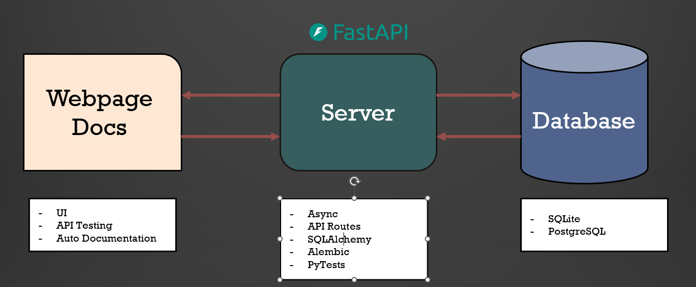

# Todo-Application
Todo Application leveraging the capabilities of FastAPI

For this project I built a simple todo application to become more familiar with FastAPI.
- Fast API was used for creating API routes and interactions
- SQLAlchemy handled various DB connections and interactions
  - SQLite was used for testing
  - PostgreSQL was used for production
- Alembic was leveraged for data migration
- Pytest was used to create unit & integration testing

# Instructions
pip install requirements.txt

Then run the following command `uvicorn TodoApp.main:app --port 8080`
Go too `http://127.0.0.1:8080/docs` to view and test various API functionality from FastAPI

